<div ng-app="app">
  <!-- Modal -->
  <div class="modal fade" id="chiara_home_banner1_modal" tabindex="-1" role="dialog" aria-labelledby="chiara_home_banner1_modal_label">
    <div class="modal-dialog" role="document">
      <div class="modal-content">
        <div class="modal-header">
          <button type="button" class="close" data-dismiss="modal" aria-label="Close"><span aria-hidden="true">&times;</span></button>
          <h4 class="modal-title" id="chiara_home_banner1_modal_label">Code Generator: Homepage 5 Banners</h4>
        </div>
        <div class="modal-body">
          <form>
            <div class="panel-group" id="chiara_home_banner1_accordion" role="tablist" aria-multiselectable="true">
              <div class="panel panel-default">
                <div class="panel-heading">
                  <h4 class="panel-title">
                      Homepage banner 1
                  </h4>
                </div>
                <div class="panel-body">
                  <div class="form-group">
                    <label for="chiara_home_banner1_img_bg">Background Image URL:</label>
                    <input ng-model="img_bg" type="text" class="form-control" id="chiara_home_banner1_img_bg" ng-init="img_bg='/product_images/uploaded_images/banner1.gif'">
                  </div>
                  <div class="form-group">
                    <label for="chiara_home_banner1_alt">Image Alt:</label>
                    <input ng-model="img_alt" type="text" class="form-control" id="chiara_home_banner1_alt" ng-init="img_alt='Hompage banner 1'">
                  </div>
                  <div class="form-group">
                    <label for="chiara_home_banner1_btn1_url">Button 1 Url:</label>
                    <input ng-model="btn1_url" type="text" class="form-control" id="chiara_home_banner1_btn1_url" ng-init="btn1_url='#'">
                  </div>
                  <div class="form-group">
                    <label for="chiara_home_banner1_btn1_text">Button 1 Text:</label>
                    <input ng-model="btn1_text" type="text" class="form-control" id="chiara_home_banner1_btn1_text" ng-init="btn1_text='Shop new'">
                  </div>
                  <div class="form-group">
                    <label for="chiara_home_banner1_btn2_url">Button 2 Url:</label>
                    <input ng-model="btn2_url" type="text" class="form-control" id="chiara_home_banner1_btn2_url" ng-init="btn2_url='#'">
                  </div>
                  <div class="form-group">
                    <label for="chiara_home_banner1_btn2_text">Button 2 Text:</label>
                    <input ng-model="btn2_text" type="text" class="form-control" id="chiara_home_banner1_btn2_text" ng-init="btn2_text='Shop Sale'">
                  </div>
                  <div class="form-group">
                    <label for="chiara_home_banner1_btn3_url">Button 3 Url:</label>
                    <input ng-model="btn3_url" type="text" class="form-control" id="chiara_home_banner1_btn3_url" ng-init="btn3_url='#'">
                  </div>
                  <div class="form-group">
                    <label for="chiara_home_banner1_btn3_text">Button 3 Text:</label>
                    <input ng-model="btn3_text" type="text" class="form-control" id="chiara_home_banner1_btn3_text" ng-init="btn3_text='Shop Extra'">
                  </div>
                </div>
              </div>
            </div>
            <div hljs include="'/samples/chiara_home_banner1.txt'" compile="true" id="chiara_home_banner1_code" class="highlight-code"></div>
          </form>
        </div>
        <div class="modal-footer">
          <button type="button" class="btn btn-default" data-dismiss="modal">Close</button>
          <button type="button" class="btn btn-primary" data-clipboard-target="#chiara_home_banner1_code">Copy Code</button>
        </div>
      </div>
    </div>
  </div><!-- modal #chiara_home_banner1_modal -->
  <!-- Modal -->
  <div class="modal fade" id="chiara_home_banner2_modal" tabindex="-1" role="dialog" aria-labelledby="chiara_home_banner2_modal_label">
    <div class="modal-dialog" role="document">
      <div class="modal-content">
        <div class="modal-header">
          <button type="button" class="close" data-dismiss="modal" aria-label="Close"><span aria-hidden="true">&times;</span></button>
          <h4 class="modal-title" id="chiara_home_banner2_modal_label">Code Generator: Homepage Fullwidth Banner</h4>
        </div>
        <div class="modal-body">
          <form>
            <div class="panel-group" id="chiara_home_banner2_accordion" role="tablist" aria-multiselectable="true">
              <div class="panel panel-default">
                <div class="panel-heading" role="tab" id="chiara_home_banner2_heading">
                  <h4 class="panel-title">
                    <a role="button" data-toggle="collapse" data-parent="#chiara_home_banner2_accordion" href="#chiara_home_banner2_collapse" aria-expanded="true" aria-controls="chiara_home_banner2_collapse">
                      Banner 2
                    </a>
                  </h4>
                </div>
                <div id="chiara_home_banner2_collapse" class="panel-collapse collapse in" role="tabpanel" aria-labelledby="chiara_home_banner2_heading">
                  <div class="panel-body">
                  <div class="form-group">
                      <label for="chiara_home_banner2_title">Banner title</label>
                      <input ng-model="banner2_title" type="text" class="form-control" id="chiara_home_banner2_title" ng-init="banner2_title='Comfortable, confident, sexy.'">
                    </div>
                    <div class="form-group">
                      <label for="chiara_home_banner2_img_bg">Background Image URL:</label>
                      <input ng-model="banner2_img_bg" type="text" class="form-control" id="chiara_home_banner2_img_bg" ng-init="banner2_img_bg='/product_images/uploaded_images/banner2.gif'">
                    </div>
                    <div class="form-group">
                      <label for="chiara_home_banner2_alt">Background Image Alt:</label>
                      <input ng-model="banner2_img_alt" type="text" class="form-control" id="chiara_home_banner2_alt" ng-init="banner2_img_alt='banner2.gif'">
                    </div>
                    <div class="form-group">
                      <label for="chiara_home_banner2_button_link">Button link URL:</label>
                      <input ng-model="banner2_button_link" type="text" class="form-control" id="chiara_home_banner2_button_link" ng-init="banner2_button_link='#'">
                    </div>
                    <div class="form-group">
                      <label for="chiara_home_banner2_button_text">Button text:</label>
                      <input ng-model="banner2_button_text" type="text" class="form-control" id="chiara_home_banner2_button_text" ng-init="banner2_button_text='Shop sale'">
                    </div>
                  </div>
                </div>
              </div>
            </div>
            <div hljs include="'/samples/chiara_home_banner2.txt'" compile="true" id="chiara_home_banner2_code" class="highlight-code"></div>
          </form>
        </div>
        <div class="modal-footer">
          <button type="button" class="btn btn-default" data-dismiss="modal">Close</button>
          <button type="button" class="btn btn-primary" data-clipboard-target="#chiara_home_banner2_code">Copy Code</button>
        </div>
      </div>
    </div>
  </div><!-- modal #chiara_home_banner2_modal -->
  <!-- Modal -->
  <div class="modal fade" id="chiara_home_banner3_modal" tabindex="-1" role="dialog" aria-labelledby="chiara_home_banner3_modal_label">
    <div class="modal-dialog" role="document">
      <div class="modal-content">
        <div class="modal-header">
          <button type="button" class="close" data-dismiss="modal" aria-label="Close"><span aria-hidden="true">&times;</span></button>
          <h4 class="modal-title" id="chiara_home_banner3_modal_label">Code Generator: Images Carousel</h4>
        </div>
        <div class="modal-body">
          <form>
            <div class="panel-group" id="chiara_home_banner3_accordion" role="tablist" aria-multiselectable="true">
              <div class="panel panel-default">
                <div class="panel-heading" role="tab" id="chiara_home_banner3_heading">
                  <h4 class="panel-title">
                    <a class="collapsed" role="button" data-toggle="collapse" data-parent="#chiara_home_banner3_accordion" href="#chiara_home_banner3_collapse" aria-expanded="false" aria-controls="chiara_home_banner3_collapse">
                      Banner image 3
                    </a>
                  </h4>
                </div>
                <div id="chiara_home_banner3_collapse" class="panel-collapse collapse" role="tabpanel" aria-labelledby="chiara_home_banner3_item8_heading">
                  <div class="panel-body">
                    <div class="form-group">
                      <label for="chiara_home_banner3_left_url">Banner left image URL:</label>
                      <input ng-model="banner3_left_url" type="text" class="form-control" id="chiara_home_banner3_left_url"
                      ng-init="banner3_left_url='/product_images/uploaded_images/banner1.jpg'">
                    </div>
                    <div class="form-group">
                      <label for="chiara_home_banner3_left_alt">Banner left image Alt:</label>
                      <input ng-model="banner3_left_alt" type="text" class="form-control" id="chiara_home_banner3_left_alt"
                      ng-init="banner3_left_alt='banner1.jpg'">
                    </div>
                    <div class="form-group">
                      <label for="chiara_home_banner3_right_url">Banner right image URL:</label>
                      <input ng-model="banner3_right_url" type="text" class="form-control" id="chiara_home_banner3_right_url"
                      ng-init="banner3_right_url='/product_images/uploaded_images/banner4.jpg'">
                    </div>
                    <div class="form-group">
                      <label for="chiara_home_banner3_right_alt">Banner right image Alt:</label>
                      <input ng-model="banner3_right_alt" type="text" class="form-control" id="chiara_home_banner3_right_alt"
                      ng-init="banner3_right_alt='banner4.jpg'">
                    </div>
                    <div class="form-group">
                      <label for="chiara_home_banner3_title">Banner 3 left title:</label>
                      <input ng-model="banner3_right_title" type="text" class="form-control" id="chiara_home_banner3_title" ng-init="banner3_right_title='Buy 1 Get 1'">
                    </div>
                    <div class="form-group">
                      <label for="chiara_home_banner3_button_url">Banner 3 button URL:</label>
                      <input ng-model="banner3_button_url" type="text" class="form-control" id="chiara_home_banner3_button_url"
                      ng-init="banner3_button_url='#'">
                    </div>
                    <div class="form-group">
                      <label for="chiara_home_banner3_button_text">Banner 3 button text:</label>
                      <input ng-model="banner3_button_text" type="text" class="form-control" id="chiara_home_banner3_button_text"
                      ng-init="banner3_button_text='See full collection'">
                    </div>
                  </div>
                </div>
              </div>
            </div>
            <div hljs include="'/samples/chiara_home_banner3.txt'" compile="true" id="chiara_home_banner3_code" class="highlight-code"></div>
          </form>
        </div>
        <div class="modal-footer">
          <button type="button" class="btn btn-default" data-dismiss="modal">Close</button>
          <button type="button" class="btn btn-primary" data-clipboard-target="#chiara_home_banner3_code">Copy Code</button>
        </div>
      </div>
    </div>
  </div><!-- modal #chiara_home_banner3_modal -->
  <!-- Modal -->
  <div class="modal fade" id="chiara_home_banner4_modal" tabindex="-1" role="dialog" aria-labelledby="chiara_home_banner4_modal_label">
    <div class="modal-dialog" role="document">
      <div class="modal-content">
        <div class="modal-header">
          <button type="button" class="close" data-dismiss="modal" aria-label="Close"><span aria-hidden="true">&times;</span></button>
          <h4 class="modal-title" id="chiara_home_banner3_modal_label">Homepage banner 4</h4>
        </div>
        <div class="modal-body">
          <form>
            <div class="form-group">
              <label for="chiara_home_banner4_heading">Title Heading:</label>
              <input ng-model="banner4_heading" type="text" class="form-control" id="chiara_home_banner4_heading" ng-init="banner4_heading='more to love'">
            </div>
            <div class="panel-group" id="chiara_home_banner3_accordion" role="tablist" aria-multiselectable="true">
              <div class="panel panel-default">
                <div class="panel-heading" role="tab" id="chiara_home_banner4_item1_heading">
                  <h4 class="panel-title">
                    <a class="collapsed" role="button" data-toggle="collapse" data-parent="#chiara_home_banner3_accordion" href="#chiara_home_banner4_item1_collapse" aria-expanded="false" aria-controls="chiara_home_banner4_item1_collapse">
                      Item1
                    </a>
                  </h4>
                </div>
                <div id="chiara_home_banner4_item1_collapse" class="panel-collapse collapse" role="tabpanel" aria-labelledby="chiara_home_banner4_item1_heading">
                  <div class="panel-body">
                    <div class="form-group">
                      <label for="chiara_home_banner4_item1_img">Image URL:</label>
                      <input ng-model="banner4_item1_img" type="text" class="form-control" id="chiara_home_banner4_item1_img" ng-init="banner4_item1_img='/product_images/uploaded_images/blog1.jpg'">
                    </div>
                    <div class="form-group">
                      <label for="chiara_home_banner4_item1_alt">Image Alt:</label>
                      <input ng-model="banner4_item1_alt" type="text" class="form-control" id="chiara_home_banner4_item1_alt"
                      ng-init="banner4_item1_alt='blog1.jpg'">
                    </div>
                    <div class="form-group">
                      <label for="chiara_home_banner4_item1_title">Banner title:</label>
                      <input ng-model="banner4_item1_title" type="text" class="form-control" id="chiara_home_banner4_item1_title"
                      ng-init="banner4_item1_title='Whats the occasion?'">
                    </div>
                    <div class="form-group">
                      <label for="chiara_home_banner4_item1_desc">Button URL:</label>
                      <input ng-model="banner4_item1_desc" type="text" class="form-control" id="chiara_home_banner4_item1_desc"
                      ng-init="banner4_item1_desc='All you gotta do now is RSVP'">
                    </div>
                    <div class="form-group">
                      <label for="chiara_home_banner4_item1_button_url">Button URL:</label>
                      <input ng-model="banner4_item1_button_url" type="text" class="form-control" id="chiara_home_banner4_item1_button_url"
                      ng-init="banner4_item1_button_url='#'">
                    </div>
                    <div class="form-group">
                      <label for="chiara_home_banner4_item1_button_text">Button text:</label>
                      <input ng-model="banner4_item1_button_text" type="text" class="form-control" id="chiara_home_banner4_item1_button_text"
                      ng-init="banner4_item1_button_text='#'">
                    </div>
                  </div>
                </div>
              </div>
              <div class="panel panel-default">
                <div class="panel-heading" role="tab" id="chiara_home_banner4_item2_heading">
                  <h4 class="panel-title">
                    <a class="collapsed" role="button" data-toggle="collapse" data-parent="#chiara_home_banner3_accordion" href="#chiara_home_banner4_item2_collapse" aria-expanded="false" aria-controls="chiara_home_banner4_item2_collapse">
                      Item2
                    </a>
                  </h4>
                </div>
                <div id="chiara_home_banner4_item2_collapse" class="panel-collapse collapse" role="tabpanel" aria-labelledby="chiara_home_banner4_item2_heading">
                  <div class="panel-body">
                    <div class="form-group">
                      <label for="chiara_home_banner4_item2_img">Image URL:</label>
                      <input ng-model="banner4_item2_img" type="text" class="form-control" id="chiara_home_banner4_item2_img" ng-init="banner4_item2_img='/product_images/uploaded_images/blog2.jpg'">
                    </div>
                    <div class="form-group">
                      <label for="chiara_home_banner4_item2_alt">Image Alt:</label>
                      <input ng-model="banner4_item2_alt" type="text" class="form-control" id="chiara_home_banner4_item2_alt"
                      ng-init="banner4_item2_alt='blog2.jpg'">
                    </div>
                    <div class="form-group">
                      <label for="chiara_home_banner4_item2_title">Banner title:</label>
                      <input ng-model="banner4_item2_title" type="text" class="form-control" id="chiara_home_banner4_item2_title"
                      ng-init="banner4_item2_title='High-impact crop tops'">
                    </div>
                    <div class="form-group">
                      <label for="chiara_home_banner4_item2_desc">Button URL:</label>
                      <input ng-model="banner4_item2_desc" type="text" class="form-control" id="chiara_home_banner4_item2_desc"
                      ng-init="banner4_item2_desc='All you gotta do now is RSVP'">
                    </div>
                    <div class="form-group">
                      <label for="chiara_home_banner4_item2_button_url">Button URL:</label>
                      <input ng-model="banner4_item2_button_url" type="text" class="form-control" id="chiara_home_banner4_item2_button_url"
                      ng-init="banner4_item2_button_url='#'">
                    </div>
                    <div class="form-group">
                      <label for="chiara_home_banner4_item2_button_text">Button text:</label>
                      <input ng-model="banner4_item2_button_text" type="text" class="form-control" id="chiara_home_banner4_item2_button_text"
                      ng-init="banner4_item2_button_text='View the feature'">
                    </div>
                  </div>
                </div>
              </div>
              <div class="panel panel-default">
                <div class="panel-heading" role="tab" id="chiara_home_banner4_item3_heading">
                  <h4 class="panel-title">
                    <a class="collapsed" role="button" data-toggle="collapse" data-parent="#chiara_home_banner3_accordion" href="#chiara_home_banner4_item3_collapse" aria-expanded="false" aria-controls="chiara_home_banner4_item3_collapse">
                      item3
                    </a>
                  </h4>
                </div>
                <div id="chiara_home_banner4_item3_collapse" class="panel-collapse collapse" role="tabpanel" aria-labelledby="chiara_home_banner4_item3_heading">
                  <div class="panel-body">
                    <div class="form-group">
                      <label for="chiara_home_banner4_item3_img">Image URL:</label>
                      <input ng-model="banner4_item3_img" type="text" class="form-control" id="chiara_home_banner4_item3_img" ng-init="banner4_item3_img='/product_images/uploaded_images/blog3.jpg'">
                    </div>
                    <div class="form-group">
                      <label for="chiara_home_banner4_item3_alt">Image Alt:</label>
                      <input ng-model="banner4_item3_alt" type="text" class="form-control" id="chiara_home_banner4_item3_alt"
                      ng-init="banner4_item3_alt='blog2.jpg'">
                    </div>
                    <div class="form-group">
                      <label for="chiara_home_banner4_item3_title">Banner title:</label>
                      <input ng-model="banner4_item3_title" type="text" class="form-control" id="chiara_home_banner4_item3_title"
                      ng-init="banner4_item3_title='Get yourself in peak'">
                    </div>
                    <div class="form-group">
                      <label for="chiara_home_banner4_item3_desc">Button URL:</label>
                      <input ng-model="banner4_item3_desc" type="text" class="form-control" id="chiara_home_banner4_item3_desc"
                      ng-init="banner4_item3_desc='Your summer workouts start now'">
                    </div>
                    <div class="form-group">
                      <label for="chiara_home_banner4_item3_button_url">Button URL:</label>
                      <input ng-model="banner4_item3_button_url" type="text" class="form-control" id="chiara_home_banner4_item3_button_url"
                      ng-init="banner4_item3_button_url='#'">
                    </div>
                    <div class="form-group">
                      <label for="chiara_home_banner4_item3_button_text">Button text:</label>
                      <input ng-model="banner4_item3_button_text" type="text" class="form-control" id="chiara_home_banner4_item3_button_text"
                      ng-init="banner4_item3_button_text='Shop summer 2018'">
                    </div>
                  </div>
                </div>
              </div>
            </div>
            <div hljs include="'/samples/chiara_home_banner4.txt'" compile="true" id="chiara_home_banner3_code" class="highlight-code"></div>
          </form>
        </div>
        <div class="modal-footer">
          <button type="button" class="btn btn-default" data-dismiss="modal">Close</button>
          <button type="button" class="btn btn-primary" data-clipboard-target="#chiara_home_banner3_code">Copy Code</button>
        </div>
      </div>
    </div>
  </div><!-- modal #chiara_home_banner4_modal -->
  <!-- Modal -->
  <div class="modal fade" id="chiara_sidebar_category_banner1_modal" tabindex="-1" role="dialog" aria-labelledby="chiara_sidebar_category_banner1_modal_label">
    <div class="modal-dialog" role="document">
      <div class="modal-content">
        <div class="modal-header">
          <button type="button" class="close" data-dismiss="modal" aria-label="Close"><span aria-hidden="true">&times;</span></button>
          <h4 class="modal-title" id="chiara_sidebar_category_banner1_modal_label">Code Generator: Sidebar Category Banner 1</h4>
        </div>
        <div class="modal-body">
          <form>
            <div class="panel-group" id="chiara_sidebar_category_banner1_accordion" role="tablist" aria-multiselectable="true">
              <div class="panel panel-default">
                <div class="panel-heading" role="tab" id="chiara_sidebar_category_banner1_item1_heading">
                  <h4 class="panel-title">
                    <a role="button" data-toggle="collapse" data-parent="#chiara_sidebar_category_banner1_accordion" href="#chiara_sidebar_category_banner1_item1_collapse" aria-expanded="true" aria-controls="chiara_sidebar_category_banner1_item1_collapse">
                      Image
                    </a>
                  </h4>
                </div>
                <div id="chiara_sidebar_category_banner1_item1_collapse" class="panel-collapse collapse in" role="tabpanel" aria-labelledby="chiara_sidebar_category_banner1_item1_heading">
                  <div class="panel-body">
                    <div class="form-group">
                      <label for="chiara_sidebar_category_banner1_item1_img">Image URL:</label>
                      <input ng-model="item1_img" type="text" class="form-control" id="chiara_sidebar_category_banner1_item1_img" ng-init="item1_img='/product_images/uploaded_images/banner3.gif'">
                    </div>
                    <div class="form-group">
                      <label for="chiara_sidebar_category_banner1_item1_alt">Image Alt:</label>
                      <input ng-model="item1_alt" type="text" class="form-control" id="chiara_sidebar_category_banner1_item1_alt"
                      ng-init="item1_alt='banner3.gif'">
                    </div>
                    <div class="form-group">
                      <label for="chiara_sidebar_category_banner1_item1_button_url">Button url:</label>
                      <input ng-model="item1_button_url" type="text" class="form-control" id="chiara_sidebar_category_banner1_item1_button_url"
                      ng-init="item1_button_url='#'">
                    </div>
                    <div class="form-group">
                      <label for="chiara_sidebar_category_banner1_item1_button_text">Button url:</label>
                      <input ng-model="item1_button_text" type="text" class="form-control" id="chiara_sidebar_category_banner1_item1_button_text"
                      ng-init="item1_button_text='banner3.gif'">
                    </div>
                  </div>
                </div>
              </div>
            </div>
            <div hljs include="'/samples/chiara_sidebar_category_banner1.txt'" compile="true" id="chiara_sidebar_category_banner1_code" class="highlight-code"></div>
          </form>
        </div>
        <div class="modal-footer">
          <button type="button" class="btn btn-default" data-dismiss="modal">Close</button>
          <button type="button" class="btn btn-primary" data-clipboard-target="#chiara_sidebar_category_banner1_code">Copy Code</button>
        </div>
      </div>
    </div>
  </div><!-- modal #chiara_sidebar_category_banner1_modal -->
  <!-- Modal -->
  <div class="modal fade" id="chiara_sidebar_category_banner2_modal" tabindex="-1" role="dialog" aria-labelledby="chiara_sidebar_category_banner2_modal_label">
    <div class="modal-dialog" role="document">
      <div class="modal-content">
        <div class="modal-header">
          <button type="button" class="close" data-dismiss="modal" aria-label="Close"><span aria-hidden="true">&times;</span></button>
          <h4 class="modal-title" id="chiara_sidebar_category_banner2_modal_label">Code Generator: Sidebar Category Banner 2</h4>
        </div>
        <div class="modal-body">
          <form>
            <div class="panel-group" id="chiara_sidebar_category_banner2_accordion" role="tablist" aria-multiselectable="true">
              <div class="panel panel-default">
                <div class="panel-heading" role="tab" id="chiara_sidebar_category_banner2_item1_heading">
                  <h4 class="panel-title">
                    <a role="button" data-toggle="collapse" data-parent="#chiara_sidebar_category_banner2_accordion" href="#chiara_sidebar_category_banner2_item1_collapse" aria-expanded="true" aria-controls="chiara_sidebar_category_banner2_item1_collapse">
                      Image
                    </a>
                  </h4>
                </div>
                <div id="chiara_sidebar_category_banner2_item1_collapse" class="panel-collapse collapse in" role="tabpanel" aria-labelledby="chiara_sidebar_category_banner2_item1_heading">
                  <div class="panel-body">
                    <div class="form-group">
                      <label for="chiara_sidebar_category_banner2_item1_img">Image URL:</label>
                      <input ng-model="item1_img" type="text" class="form-control" id="chiara_sidebar_category_banner2_item1_img" ng-init="item1_img='/product_images/uploaded_images/banner3.gif'">
                    </div>
                    <div class="form-group">
                      <label for="chiara_sidebar_category_banner2_item1_alt">Image Alt:</label>
                      <input ng-model="item1_alt" type="text" class="form-control" id="chiara_sidebar_category_banner2_item1_alt"
                      ng-init="item1_alt='banner3.gif'">
                    </div>
                    <div class="form-group">
                      <label for="chiara_sidebar_category_banner2_item1_button_url">Button url:</label>
                      <input ng-model="item1_button_url" type="text" class="form-control" id="chiara_sidebar_category_banner2_item1_button_url"
                      ng-init="item1_button_url='#'">
                    </div>
                    <div class="form-group">
                      <label for="chiara_sidebar_category_banner2_item1_button_text">Button url:</label>
                      <input ng-model="item1_button_text" type="text" class="form-control" id="chiara_sidebar_category_banner2_item1_button_text"
                      ng-init="item1_button_text='banner3.gif'">
                    </div>
                  </div>
                </div>
              </div>
            </div>
            <div hljs include="'/samples/chiara_sidebar_category_banner2.txt'" compile="true" id="chiara_sidebar_category_banner2_code" class="highlight-code"></div>
          </form>
        </div>
        <div class="modal-footer">
          <button type="button" class="btn btn-default" data-dismiss="modal">Close</button>
          <button type="button" class="btn btn-primary" data-clipboard-target="#chiara_sidebar_category_banner2_code">Copy Code</button>
        </div>
      </div>
    </div>
  </div><!-- modal #chiara_sidebar_category_banner2_modal -->
  <!-- Modal -->
  <div class="modal fade" id="chiara_sidebar_brand_banner1_modal" tabindex="-1" role="dialog" aria-labelledby="chiara_sidebar_brand_banner1_modal_label">
    <div class="modal-dialog" role="document">
      <div class="modal-content">
        <div class="modal-header">
          <button type="button" class="close" data-dismiss="modal" aria-label="Close"><span aria-hidden="true">&times;</span></button>
          <h4 class="modal-title" id="chiara_sidebar_brand_banner1_modal_label">Code Generator: Sidebar Brand Banner 1</h4>
        </div>
        <div class="modal-body">
          <form>
            <div class="panel-group" id="chiara_sidebar_brand_banner1_accordion" role="tablist" aria-multiselectable="true">
              <div class="panel panel-default">
                <div class="panel-heading" role="tab" id="chiara_sidebar_brand_banner1_item1_heading">
                  <h4 class="panel-title">
                    <a role="button" data-toggle="collapse" data-parent="#chiara_sidebar_brand_banner1_accordion" href="#chiara_sidebar_brand_banner1_item1_collapse" aria-expanded="true" aria-controls="chiara_sidebar_brand_banner1_item1_collapse">
                      Image
                    </a>
                  </h4>
                </div>
                <div id="chiara_sidebar_brand_banner1_item1_collapse" class="panel-collapse collapse in" role="tabpanel" aria-labelledby="chiara_sidebar_brand_banner1_item1_heading">
                  <div class="panel-body">
                    <div class="form-group">
                      <label for="chiara_sidebar_brand_banner1_item1_img">Image URL:</label>
                      <input ng-model="item1_img" type="text" class="form-control" id="chiara_sidebar_brand_banner1_item1_img" ng-init="item1_img='/product_images/uploaded_images/banner3.gif'">
                    </div>
                    <div class="form-group">
                      <label for="chiara_sidebar_brand_banner1_item1_alt">Image Alt:</label>
                      <input ng-model="item1_alt" type="text" class="form-control" id="chiara_sidebar_brand_banner1_item1_alt"
                      ng-init="item1_alt='banner3.gif'">
                    </div>
                    <div class="form-group">
                      <label for="chiara_sidebar_brand_banner1_item1_button_url">Button url:</label>
                      <input ng-model="item1_button_url" type="text" class="form-control" id="chiara_sidebar_brand_banner1_item1_button_url"
                      ng-init="item1_button_url='#'">
                    </div>
                    <div class="form-group">
                      <label for="chiara_sidebar_brand_banner1_item1_button_text">Button url:</label>
                      <input ng-model="item1_button_text" type="text" class="form-control" id="chiara_sidebar_brand_banner1_item1_button_text"
                      ng-init="item1_button_text='banner3.gif'">
                    </div>
                  </div>
                </div>
              </div>
            </div>
            <div hljs include="'/samples/chiara_sidebar_brand_banner1.txt'" compile="true" id="chiara_sidebar_brand_banner1_code" class="highlight-code"></div>
          </form>
        </div>
        <div class="modal-footer">
          <button type="button" class="btn btn-default" data-dismiss="modal">Close</button>
          <button type="button" class="btn btn-primary" data-clipboard-target="#chiara_sidebar_brand_banner1_code">Copy Code</button>
        </div>
      </div>
    </div>
  </div><!-- modal #chiara_sidebar_brand_banner1_modal -->
  <!-- Modal -->
  <div class="modal fade" id="chiara_sidebar_brand_banner2_modal" tabindex="-1" role="dialog" aria-labelledby="chiara_sidebar_brand_banner2_modal_label">
    <div class="modal-dialog" role="document">
      <div class="modal-content">
        <div class="modal-header">
          <button type="button" class="close" data-dismiss="modal" aria-label="Close"><span aria-hidden="true">&times;</span></button>
          <h4 class="modal-title" id="chiara_sidebar_brand_banner2_modal_label">Code Generator: Sidebar Brand Banner 2</h4>
        </div>
        <div class="modal-body">
          <form>
            <div class="panel-group" id="chiara_sidebar_brand_banner2_accordion" role="tablist" aria-multiselectable="true">
              <div class="panel panel-default">
                <div class="panel-heading" role="tab" id="chiara_sidebar_brand_banner2_item1_heading">
                  <h4 class="panel-title">
                    <a role="button" data-toggle="collapse" data-parent="#chiara_sidebar_brand_banner2_accordion" href="#chiara_sidebar_brand_banner2_item1_collapse" aria-expanded="true" aria-controls="chiara_sidebar_brand_banner2_item1_collapse">
                      Image
                    </a>
                  </h4>
                </div>
                <div id="chiara_sidebar_brand_banner2_item1_collapse" class="panel-collapse collapse in" role="tabpanel" aria-labelledby="chiara_sidebar_brand_banner2_item1_heading">
                  <div class="panel-body">
                    <div class="form-group">
                      <label for="chiara_sidebar_brand_banner2_item1_img">Image URL:</label>
                      <input ng-model="item1_img" type="text" class="form-control" id="chiara_sidebar_brand_banner2_item1_img" ng-init="item1_img='/product_images/uploaded_images/banner3.gif'">
                    </div>
                    <div class="form-group">
                      <label for="chiara_sidebar_brand_banner2_item1_alt">Image Alt:</label>
                      <input ng-model="item1_alt" type="text" class="form-control" id="chiara_sidebar_brand_banner2_item1_alt"
                      ng-init="item1_alt='banner3.gif'">
                    </div>
                    <div class="form-group">
                      <label for="chiara_sidebar_brand_banner2_item1_button_url">Button url:</label>
                      <input ng-model="item1_button_url" type="text" class="form-control" id="chiara_sidebar_brand_banner2_item1_button_url"
                      ng-init="item1_button_url='#'">
                    </div>
                    <div class="form-group">
                      <label for="chiara_sidebar_brand_banner2_item1_button_text">Button url:</label>
                      <input ng-model="item1_button_text" type="text" class="form-control" id="chiara_sidebar_brand_banner2_item1_button_text"
                      ng-init="item1_button_text='banner3.gif'">
                    </div>
                  </div>
                </div>
              </div>
            </div>
            <div hljs include="'/samples/chiara_sidebar_brand_banner2.txt'" compile="true" id="chiara_sidebar_brand_banner2_code" class="highlight-code"></div>
          </form>
        </div>
        <div class="modal-footer">
          <button type="button" class="btn btn-default" data-dismiss="modal">Close</button>
          <button type="button" class="btn btn-primary" data-clipboard-target="#chiara_sidebar_brand_banner2_code">Copy Code</button>
        </div>
      </div>
    </div>
  </div><!-- modal #chiara_sidebar_brand_banner2_modal -->
</div>


# Customization

## READ FIRST - Customization Guideline

**Contact for Support:** <contact@papathemes.com>

### How to add your own CSS / SCSS:

- **Option 1:** Edit file `assets/scss/_lightnight-custom.scss`
- **Option 2:** Add custom CSS  in `<style>...</style>` into **Storefront** > **Footer Scripts**.

### How to add your own Javascript:

- **Option 1:** Add custom JS in `<script>...</script>` into **Storefront** > **Footer Scripts**.
- **Option 2:** Add custom JS into **Storefront** > **Scripts Manager**.


### Edit HTML:

ONLY edit file `templates/lightnight-custom.html`

--- 

_**WARNING: EDIT OTHER FILES WILL PREVENT UPGRADING THE THEME IN THE FUTURE!**_


## Headers

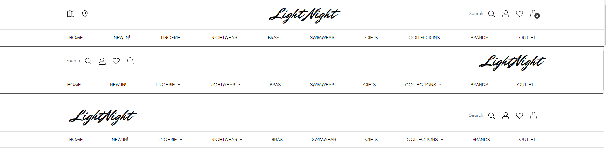

Theme supports 2 header with logo position left or right. It is configured in **Theme Editor** > **Header & Footer** > **Logo position**.

You can configure Header style, logo size, colors, fonts in **Theme Editor** > **Header & Footer**.

### Mega Menu vs. Standard Menu

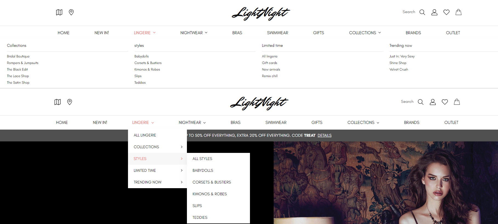

Theme supports both Mega Menu and Standard Menu. You can configure in **Theme Editor** > **Header & Footer** > **Main Navigation** > **Navigation design**.

The menu is automatically popuplated from your product categories and web pages (in **Storefront** > **Web Pages**). You can hide all web pages on this menu by tick on the option **Hide web pages in main navigation** in **Theme Editor** > **Header & Footer**.

### Top Banner

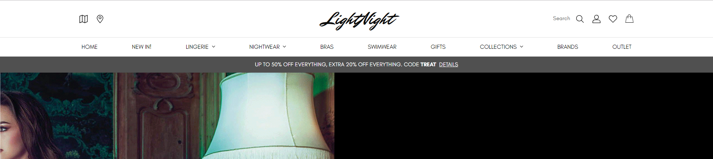

You can edit the top banner on the homepage, category pages, product pages in **Marketing** > **Banner Manager**.


## Footers

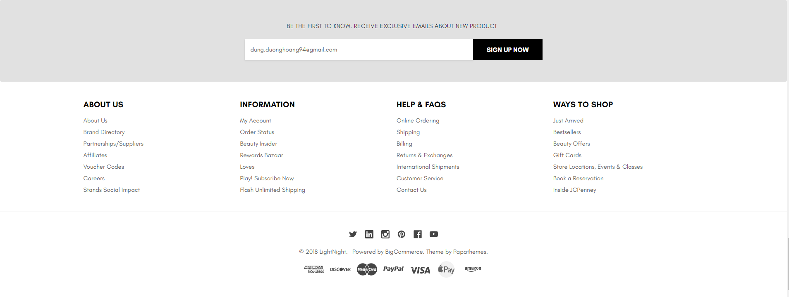

Configure the footer in **Theme Editor** > **Footer** section. 

* You can change colors.
* Show/hide web page links, categories, brands.
* Add custom links in maximum 4 columns.
* Newsletter form support top or right position of the footer.
* Change colors of the copyright section.
* Show/hide copyright links.
* Show/hide payment icons.


## Homepage Main Carousel


Main carousel displays on the home page can be input in **Storefront** > **Home Page Carousel**.

You can configure carousel settings in **Theme Editor** > **Home Page** > **Carousel** section. Here you can turn on/off this carousel, configure colors, content position and so on.


## Homepage Product by Category

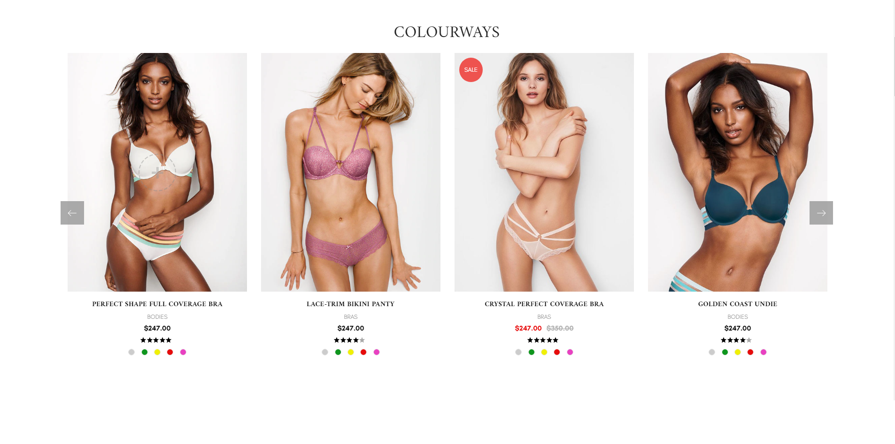

Edit banner in **Theme Editor** > **Homepage** > **Product by Category**.

* You can change limit product, category slug and button bottom to display.
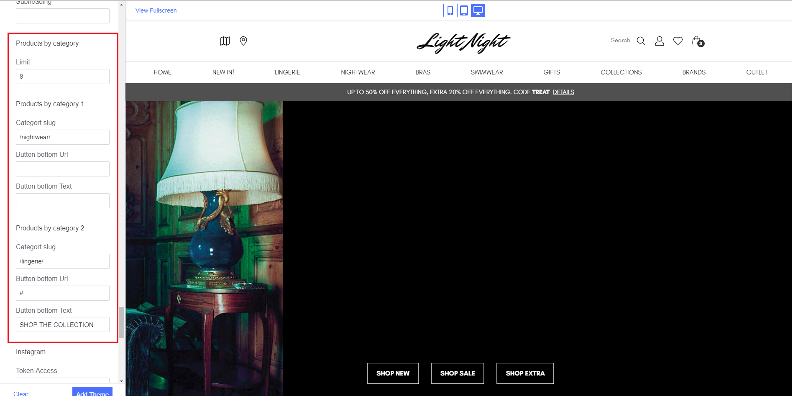


## Homepage Banners

### There are 4 Section Banners in homepage

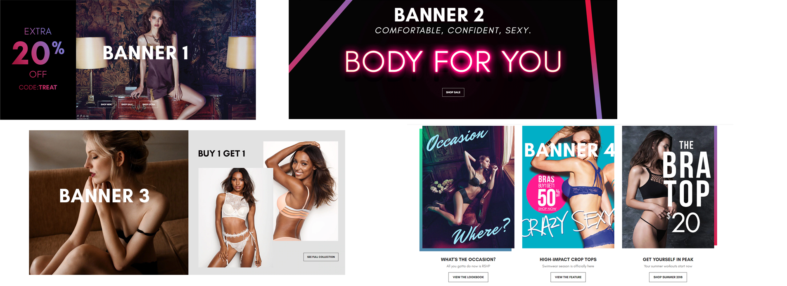

To display the banner, create a new banner in **Marketing** > **Banners**:

* **Banner Name**: `banner name`
* **Banner Content**: Click on the HTML to edit HTML source.

###Source code for banner 1

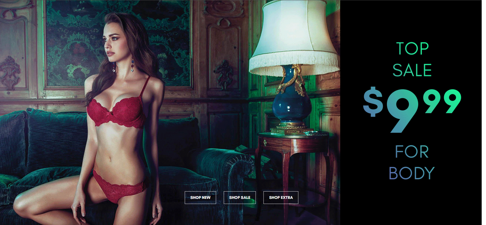

```html
<div class="lightnight-section lightnight-section--banner lightnight-section--banner--banner1" data-local-banner-position="lightnight-home-banner1">
  <div class="lightnight-banner lightnight-banner--full">
    <div class="banner-left">
      <div class="banner-content">
        <ul class="banner-action-inline-list">
          <li><a title="Shop new" class="button" href="#">Shop new</a></li>
          <li><a title="Shop Sale" class="button" href="#">Shop Sale</a></li>
          <li><a title="Shop Extra" class="button" href="#">Shop Extra</a></li>
        </ul>
      </div>
    <div class="banner-item">
      
    </div>
  </div>
</div>
```

Or use button below to generate HTML code with your custom content:

<!-- Button trigger modal -->
<button type="button" class="btn btn-primary btn-lg" data-toggle="modal" data-target="#chiara_home_banner1_modal">
  Launch Banner Code Generator
</button>

###Source code for banner 2


```html
<div class="lightnight-section lightnight-section--banner lightnight-section--banner--banner2" data-local-banner-position="lightnight-home-banner2">
  <div class="lightnight-banner lightnight-banner--full">
    <div class="banner-left">
      <div class="banner-content">
          <h4 class="banner-title">Comfortable, confident, sexy.</h4>
          <a href="#" class="button" title="Shop sale">Shop sale</a>
      </div>
    <div class="banner-item">
      
    </div>
  </div>
</div>
```

Or use button below to generate HTML code with your custom content:

<!-- Button trigger modal -->
<button type="button" class="btn btn-primary btn-lg" data-toggle="modal" data-target="#chiara_home_banner2_modal">
  Launch Banner Code Generator
</button>

###Source code for banner 3

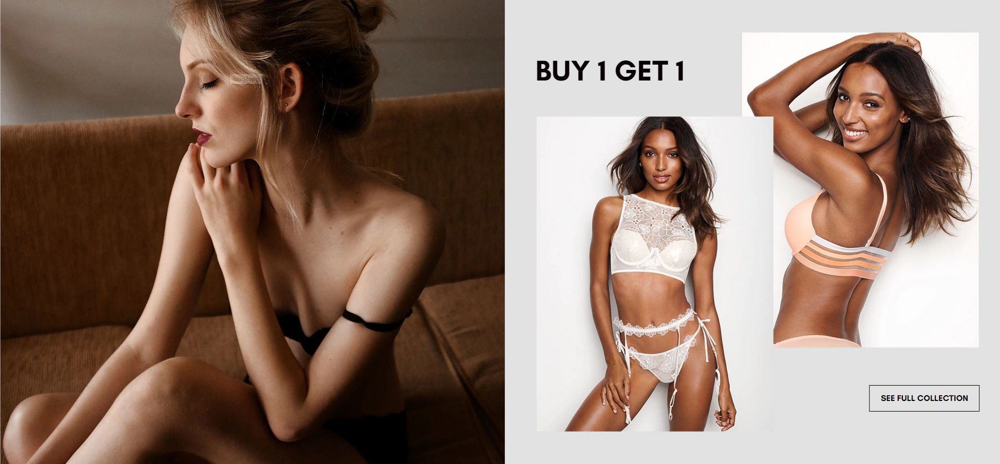

```html
<div class="lightnight-section lightnight-section--banner lightnight-section--banner--banner3" data-local-banner-position="lightnight-home-banner3">
  <div class="lightnight-banner lightnight-banner--full">
    <div class="banner-left">
      <div class="banner-item">
        
      </div>
    </div>
    <div class="banner-right">
      <div class="banner-content">
          <h4 class="banner-title">Buy 1 Get 1 </h4>
          <a href="#" class="button" title="See full collection">See full collection</a>
      </div>
      <div class="banner-item">
          
      </div>
    </div>
  </div>
</div>
```

Or use button below to generate HTML code with your custom content:

<!-- Button trigger modal -->
<button type="button" class="btn btn-primary btn-lg" data-toggle="modal" data-target="#chiara_home_banner3_modal">
  Launch Banner Code Generator
</button>

###Source code for banner 4

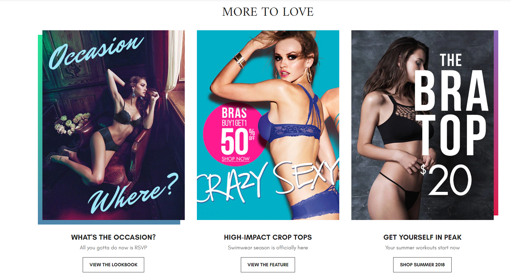

```html
<div class="lightnight-section lightnight-section--banner lightnight-section--banner--banner4" data-local-banner-position="lightnight-home-banner4">
  <div class="lightnight-banner lightnight-banner--boxed">
    <h2 class="page-heading">more to love</h2>
    <div class="banner-list">
      <div class="banner-item">
            <div class="banner-image">
                <a href="#" title="View the lookbook">
              
                </a>
            </div>
        <h4 class="banner-title">What's the occasion?</h4>
    <p class="banner-desc">All you gotta do now is RSVP</p>
    <a href="#" class="button" title="View the lookbook">View the lookbook</a>
      </div>
      <div class="banner-item">
            <div class="banner-image">
                <a href="#" title="View the feature">
              
                </a>
            </div>
        <h4 class="banner-title">High-impact crop tops</h4>
    <p class="banner-desc">Swimwear season is officially here</p>
    <a href="#" class="button" title="View the feature">View the feature</a>
      </div>
      <div class="banner-item">
            <div class="banner-image">
                <a href="#" title="View the feature">
                
                </a>
            </div>
        <h4 class="banner-title">Get yourself in peak</h4>
    <p class="banner-desc">Your summer workouts start now</p>
    <a href="#" class="button" title="Shop summer 2018">Shop summer 2018</a>
      </div>
    </div>
  </div>
</div>
```

Or use button below to generate HTML code with your custom content:

<!-- Button trigger modal -->
<button type="button" class="btn btn-primary btn-lg" data-toggle="modal" data-target="#chiara_home_banner4_modal">
  Launch Banner Code Generator
</button>

## Instagram Photos Feed

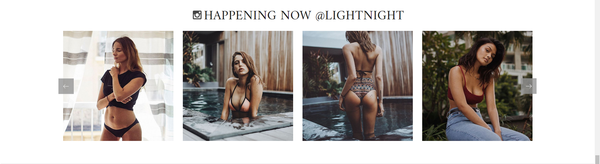

Configure Instagram section on the home page in **Theme Editor** > **Home Page** > **Instagram**:

* **Token Access**: Use this tool to generate your Instagram token access code: <https://bit.ly/2rpaWxU>.
* **Number of photos** to display.
* **Columns** (or photos per row).
* **Type**: `Boxed` - display like Furniture demo. `Fullwidth` - display like Fashion demo.
* **Heading**.
* **Subheading**.


## Sidebar - New Products, Banners & Facebook

### Custom banners on the sidebar

Theme support custom banners display on the sidebar for category pages and brand pages.

To enable these banners, open **Theme Editor** > **Sidebar**, tick on these options:

* **Show banner #1 on category pages**
* **Show banner #2 on category pages**
* **Show banner #1 on brand pages**
* **Show banner #2 on brand pages**

Create a new banner in **Marketing** > **Banners**:

#### Banner 1 on category pages

* **Banner Name**: `Sidebar banner on category pages (lightnight-sidebar-category-banner1)`
* **Banner Content**: Click on the HTML to edit HTML source.

```html
<p data-remote-banner-position="lightnight-sidebar-category-banner1"><a href="#"></a></p>
```
Or use button below to generate HTML code with your custom content:

<!-- Button trigger modal -->
<button type="button" class="btn btn-primary btn-lg" data-toggle="modal" data-target="#chiara_sidebar_category_banner1_modal">
  Launch Banner Code Generator
</button>

* **Show on Page**: `Home Page`
* **Location**: `Top of Page`


#### Banner 2 on category pages

* **Banner Name**: `Sidebar banner on category pages (lightnight-sidebar-category-banner2)`
* **Banner Content**: Click on the HTML to edit HTML source.

```html
<p data-remote-banner-position="lightnight-sidebar-category-banner2"><a href="#"></a></p>
```
Or use button below to generate HTML code with your custom content:

<!-- Button trigger modal -->
<button type="button" class="btn btn-primary btn-lg" data-toggle="modal" data-target="#chiara_sidebar_category_banner2_modal">
  Launch Banner Code Generator
</button>

* **Show on Page**: `Home Page`
* **Location**: `Top of Page`


#### Banner 1 on brand pages

* **Banner Name**: `Sidebar banner on brand pages (lightnight-sidebar-brand-banner1)`
* **Banner Content**: Click on the HTML to edit HTML source.

```html
<p data-remote-banner-position="lightnight-sidebar-brand-banner1"><a href="#"></a></p>
```
Or use button below to generate HTML code with your custom content:

<!-- Button trigger modal -->
<button type="button" class="btn btn-primary btn-lg" data-toggle="modal" data-target="#chiara_sidebar_brand_banner1_modal">
  Launch Banner Code Generator
</button>

* **Show on Page**: `Home Page`
* **Location**: `Top of Page`


#### Banner 2 on brand pages

* **Banner Name**: `Sidebar banner on brand pages (lightnight-sidebar-brand-banner2)`
* **Banner Content**: Click on the HTML to edit HTML source.

```html
<p data-remote-banner-position="lightnight-sidebar-brand-banner2"><a href="#"></a></p>
```
Or use button below to generate HTML code with your custom content:

<!-- Button trigger modal -->
<button type="button" class="btn btn-primary btn-lg" data-toggle="modal" data-target="#chiara_sidebar_brand_banner2_modal">
  Launch Banner Code Generator
</button>

* **Show on Page**: `Home Page`
* **Location**: `Top of Page`


### New Products

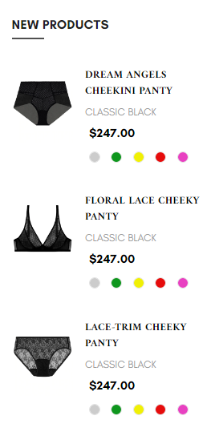

Configure in **Theme Editor** > **Sidebar**:

* **New products**: number of products to display.


### Facebook likes & chat box


Configure in **Theme Editor** > **Sidebar**, input your facebook page name in **Facebook page** text box. If your facebook page URL is `https://facebook.com/papathemes`, input only `papathemes`. Make sure your Facebook page is public for anyone in order to display on your store.


## Product Page Settings

Configure settings for product pages in **Theme Editor** > **Products**.


## Infinite product loading

Theme support infinite product loading or infinite scroll on category pages, brand pages and search results pages. It is automatically enabled by default. You can configure this option in **Theme Editor** > **Products** > **Infinite Scroll**:

* **Category pages**
* **Brands pages**
* **Brand pages**
* **Search pages**


## Product Card & Color Swatches

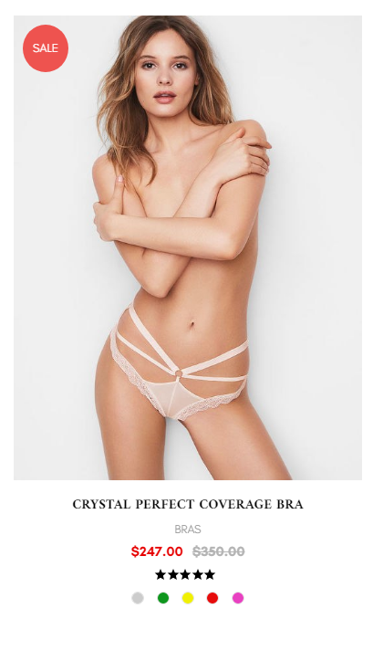

Configure how products display on listing in **Theme Editor** > **Products** > **Product cards**:

* **Product title color & hover color**.
* **Button text color & background color**.
* **Show brand**
* **Show color swatches**: To display color swatches for product options with type "Swatches".


## Bottom bar on mobile

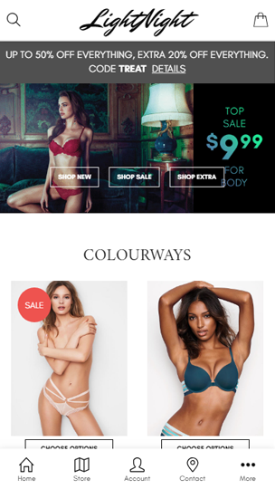

Configure this bottom bar in **Theme Editor** > **Footer** > **Bottom bar on mobile**:

* **Background color**
* **Text color**
* **Active color**
* **Icon size**
* **Font size**
* **Show Shop by Brands in Store panel**: Display "Show by Brands" link in the menu panel when lick on the Store icon.

### Contact info

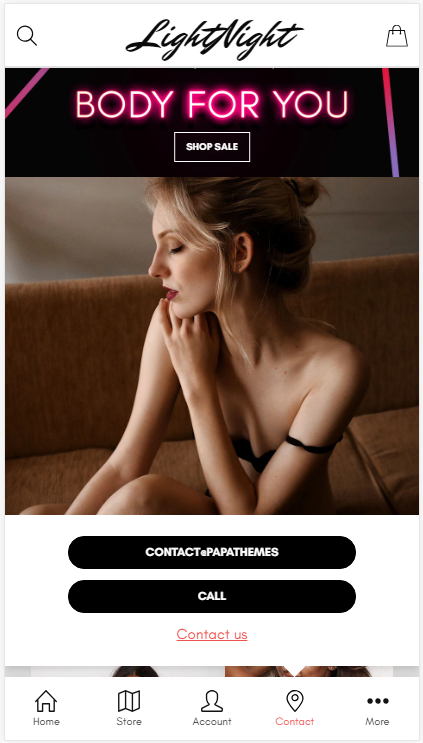

Configure contact info to display when click the Contact icon in **Theme Editor** > **Storewide** > **Contact info**:

* **Email**
* **Phone number**
* **Call text**
* **Contact page URL**
* **Contact link text**

